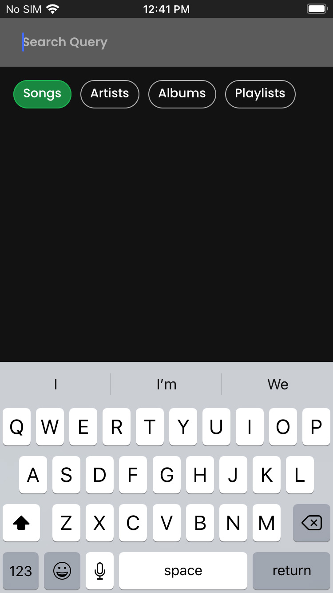

# <a id="app-overview"></a> **Spotify Clone**
This app is a clone of Spotify with it's core components: Albums, Artists, and Playlists.  The primary goal was to become more familiar with React Native, and I happened to stumble across Spotify's mostly free web API, so it seemed like a fun project to work on at the same time.  User's are able to log in to their real world Spotify account thanks to the auth flow provided by Spotify's API.  The app presents a dashboard of ready-to-use information such as recently played songs, favorite artists, featured playlists, etc.  You can sift through your playlists view the Library screen, search for new songs using the search screen, and so much more.

<br/>

<a id="app-screenshots"></a>





<br/>

## **Table of Contents**
- [Overview](#app-overview)
- [Screenshots](#app-screenshots)
- [Installation](#install)
    - [Repo Installation](#repo-install)
    - [App Installation](#app-install)
        - [Android](#install-android)
        - [IOS](#install-ios)
- [Demo](#app-demo)

<br/>

## <a id="app-demo"></a> **Demo**
Check out this [demo video walkthrough](https://youtu.be/yrsdcICGlb4) of the app

<br/><br/>

# <a id="install"></a> **Installation**

## <a id="repo-install"></a> **Repo Installation**
To clone the Github repo to your local machine, first clone the repo:

```
    git clone https://github.com/BrandonP321/spotify-clone.git
```

Lastly you must install the dependencies using yarn, not npm
```
    yarn install
```

<br/>

## <a id="app-install"></a> **App Installation**
Due to this app looking identical to Spotify, using their logos and their sign in capabilities, this app was obviously not allowed to be published to either the Google Play or IOS app stores.  Even the reviews for the app to be used for open testing failed for the same reasons. Because of this, options for viewing the deployed app are very limited.

## <a id="install-android"></a> Android
1. Install Expo through the App Store.
2. Open the App using one of the following methods
    1. QR Code
        1. Click "Scan QR Code"
        2. Scan the following QR Code <br/> 
    2. Direct Url
        1. Click "Enter URL manually"
        2. Enter in the following and click "connect": "exp://exp.host/@brandonp321/spotify-clone?release-channel=default"

## <a id="install-ios"></a> IOS
Unfortunately Apple is very strict about how apps can be installed on their iPhones.  Because of this, you are unable to view apps through Expo unless you have direct admin access to that project through Expo.  And given the fact that this app is unable to be approved for open testing through Apple Test Flight, there is currently no way to access this app at this time on IOS devices.